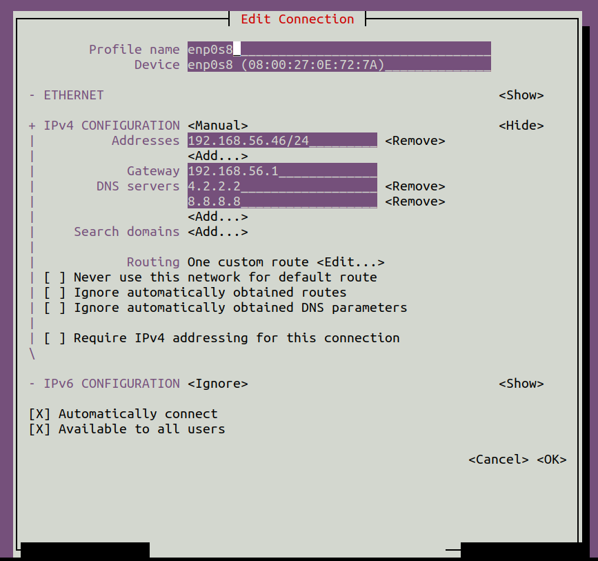

## Network Setup
The network setup we are willing to achieve consists in having each VM set up with a static IP that can be used by other machines to exchange data with it, and ssh-ing. To do so, we will use a Host-only network, provided by Virtualbox, and create the following setup:
 - Set the Ubuntu machine to have a static IP of the form `[HOST-ONLY-IP].46` (using `nmtui`)
 - Set the edge VMs (named edgeN) to have a static IP of the form `[HOST-ONLY-IP].1(N-1)` (e.g. `.10` for edge1, `.11` for edge2, and so on).

> In the described setup, the Host-only network interface has the IP range `192.168.56.0/24`.

Fist, if not already present create a Host-only network in Virtualbox, and assign it to the second network interface of the Virtual Machines through the Virtualbox settings (when the VMs are off).
Then:
- The Ubuntu 22.04.1 VM uses netplan with Network Manager as a backend, thus the Host-only network should be configured with `nmtui` (launched with sudo privileges)
  - you should reach a configuration similar to the following 
- The Ubuntu Live Server 22.04.2 VMs uses netplan with networkd backend, thus we will edit netplan's `.yaml`s files to achieve the desired configuration
  - leave `00-installer-config.yaml` as is if present, otherwise create it and paste
    ```yaml
    # This is the network config written by 'subiquity'
    network:
      ethernets:
        enp0s3:
          dhcp4: true
      version: 2
    ```
  - create a file named `01-installer-config.yaml` and paste the following lines in it
   ```yaml
    network:
      renderer: networkd
      ethernets:
        enp0s8:
          addresses:
            - 192.168.56.10/24
          nameservers:
            addresses: [4.2.2.2, 8.8.8.8]
          routes:
            - to: 0.0.0.0/0 
              via: 192.168.56.1
              metric: 100
      version: 2
   ```
   - run `sudo netplan apply` to apply the changes
 - Create a service called netplan-apply that runs netplan apply on evrey boot
   - paste this code to `/etc/systemd/system/netplan-apply.service`
     ```yaml
     [Unit]
     Description=Apply Netplan Configuration
     After=network.target
     
     [Service]
     Type=oneshot
     ExecStart=/usr/sbin/netplan apply
     
     [Install]
     WantedBy=multi-user.target
     ```
   - run `sudo systemctl enable netplan-apply.service`
 - Test the configuration by trying to ping one machine from the other, or try ssh-ing.
